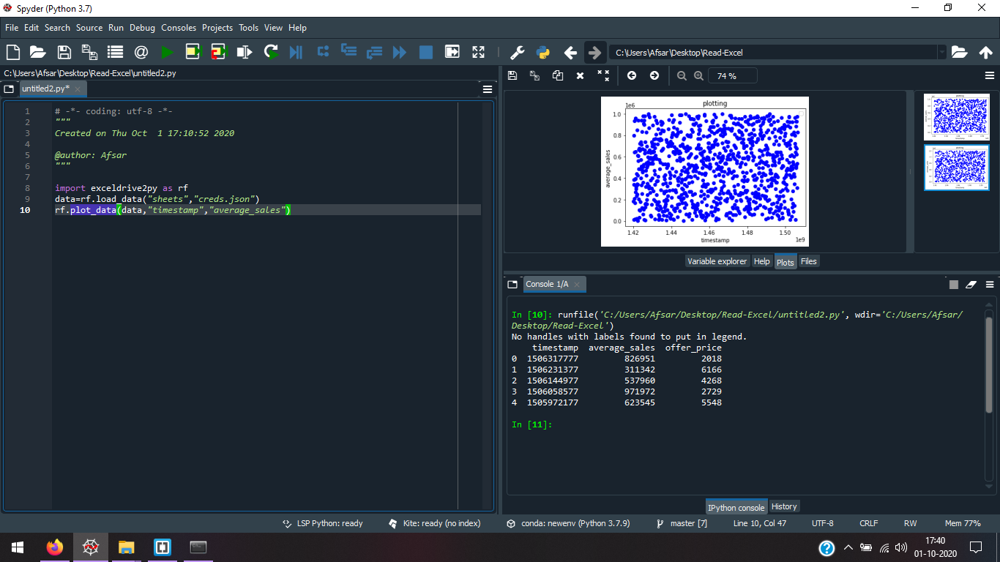

gsheets
=======

|PyPI version| |License| |Supported Python| |Format|

``gsheets`` is a small wrapper around the [`Google Sheets API`_ (v4)](https://docs.google.com/spreadsheets) to provide
more convenient access to [`Google Sheets`_](https://docs.google.com/spreadsheets) from Python scripts.

go to [google console](console.cloud.google.com)  
1.Create a Project in google cloud  
2.through Navigation menu Go ti API'S & Services and go to library  
3.search for google sheets api and enable it  
4.search for google drive api enable it and on the right side corner click on create credentials
select google drive api in which api you are using column and web server (eg node js tomcat) in  Where will you be calling the API from dropdown and tick on application data. and then no and press button 
5.fill any name in account and role select project and then editor and type json and submit. it will download the json file . 
6.open json file search client email go to google sheet you want to use and select share and give access to client email and send. 

Links
-----

- GitHub: https://github.com/afsarahmad786/Read-Excel
- PyPI: https://afsarahmad786.github.io/Read-Excel/

Installation
------------

This package runs under Python 2.7, and 3.6+, use pip_ to install:

.. code:: bash

    $ pip install exceldrive2py

This will also install google-api-python-client_ and its dependencies, notably
httplib2_ and oauth2client_, as required dependencies.

Quickstart
----------

Log into the `Google Developers Console`_ with the Google account whose
spreadsheets you want to access. Create (or select) a project and enable the
**Drive API** and **Sheets API** (under **Google Apps APIs**).

Go to the **Credentials** for your project and create **New credentials** >
**OAuth client ID** > of type **Other**. In the list of your **OAuth 2.0 client
IDs** click **Download JSON** for the Client ID you just created. Save the
file as ``client_secrets.json`` in your home directory (user directory).

import the library and load the data by passing the filename and json file downloaded from console it will return a dataframe and print top 5 rows of your data:

.. code:: python

    >>> import exceldrive2py as rf

    >>> dataframe = rf.load_data(filename_of_your_sheet,json_path)

For plotting the data you have to pass the dataframe you just loaded and pass the name X axis  columns name and Y axis column name it will plot the data for you:

.. code:: python

    for plotting
    >>> rf.plot_data(dataframe,"x-axis-column","y-axis-column")
...

